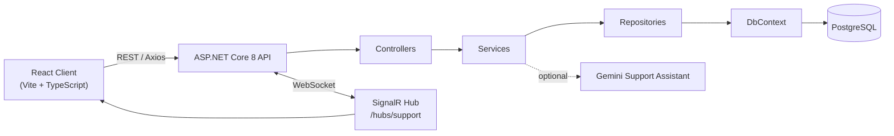
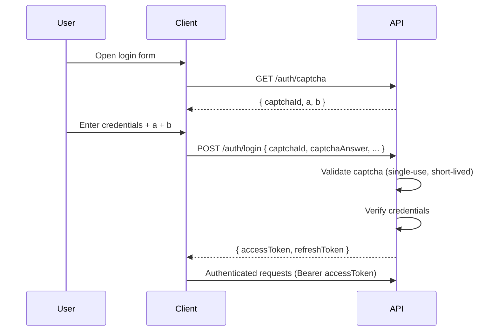

<div align="center">

# HardwareReserve

**A full-stack reservation platform for high-performance servers**

*ASP.NET Core 8 · React 19 · PostgreSQL — University Capstone Project*

[](https://dotnet.microsoft.com/)
[](https://www.postgresql.org/)
[](https://react.dev/)
[](https://www.typescriptlang.org/)
[](https://tailwindcss.com/)
[](#testing)
[](#project-notes)

</div>

<br>

<details>
<summary><strong>Table of Contents</strong></summary>

- [At a Glance](#at-a-glance)
- [Architecture](#architecture)
- [Tech Stack](#tech-stack)
- [Core Features](#core-features)
- [Project Notes](#project-notes)
- [Prerequisites](#prerequisites)
- [Configuration Reference](#configuration-reference)
- [Backend Setup](#backend-setup)
- [Frontend Setup](#frontend-setup)
- [Default Seed Data](#default-seed-data)
- [Authentication Flow](#authentication-flow)
- [Route Map](#route-map)
- [API Walkthrough (Swagger)](#api-walkthrough-swagger)
- [Testing](#testing)
- [Export Endpoints](#export-endpoints)
- [Error Response Contract](#error-response-contract)

</details>

---

## At a Glance

| | |
|---|---|
| **Type** | Full-stack web application |
| **Domain** | Server reservation & catalog management |
| **Pattern** | Layered architecture — Controllers → Services → Repositories → DbContext |
| **Auth** | JWT (access + refresh) with math-captcha gating |
| **Real-time** | SignalR-backed support channel |
| **AI-assisted support** | Optional Gemini integration with policy enforcement |

---

## Architecture



The API layer never touches the database directly — every request flows through the service layer for business rules (overlap checks, pricing, policy enforcement) before repositories translate it into `DbContext` operations.

---

## Tech Stack

| Layer | Technology |
|---|---|
| Backend framework | ASP.NET Core 8 (MVC API style) |
| ORM | Entity Framework Core 8 + Npgsql |
| Database | PostgreSQL |
| Auth | JWT — access token + refresh token rotation |
| Validation / Mapping | FluentValidation · AutoMapper |
| Backend testing | xUnit |
| Frontend | React 19 + TypeScript (Vite) |
| Routing / HTTP client | React Router · Axios |
| Styling | TailwindCSS |

---

## Core Features

| Category | Capability |
|---|---|
| **Public access** | Home & Servers catalog browsable without authentication |
| **Auth** | Math-captcha–gated login/register, JWT access + refresh tokens |
| **Authorization** | Role-based access control — `User` / `Admin` |
| **Reservations** | Overlap-safe booking engine with smart slot suggestion |
| **Checkout** | Simulated payment/checkout flow |
| **Profile** | Profile editing with image upload & crop |
| **Data export** | CSV export for users · Excel export for admins |
| **Analytics** | Dashboard stats endpoint (`/dashboard/stats`) |
| **Support** | Persistent user / anonymous / admin conversations delivered via SignalR |
| **AI support (optional)** | Gemini-backed assistant with scoped policy and read-only account context |

---

## Project Notes

> [!NOTE]
> This is an academic capstone project — some production concerns are intentionally out of scope.

> [!WARNING]
> OTP / SMS / 2FA has been intentionally removed, and Docker is intentionally not included.

---

## Prerequisites

- [.NET SDK 8.x](https://dotnet.microsoft.com/download)
- [Node.js 18+](https://nodejs.org/)
- [PostgreSQL 14+](https://www.postgresql.org/)

---

## Configuration Reference

All secrets are supplied via environment variables — committed config files only ship placeholders.

| Variable | Required | Description |
|---|---|---|
| `ConnectionStrings__DefaultConnection` | ✔ | PostgreSQL connection string |
| `Jwt__Secret` | ✔ | Signing key for access/refresh tokens |
| `Jwt__Issuer` / `Jwt__Audience` | – | JWT issuer/audience (defaults provided) |
| `Jwt__AccessTokenMinutes` / `Jwt__RefreshTokenDays` | – | Token lifetimes |
| `AutoMapper__LicenseKey` | Production only | Licensed AutoMapper key — dev/tests run without it; production fails fast if absent |
| `SupportAI__Enabled` | – | Toggles the Gemini support assistant |
| `Gemini__ApiKey` | If AI enabled | Required when `SupportAI__Enabled=true` |
| `Gemini__Model` | – | e.g. `gemini-3.6-flash` |

> [!TIP]
> If AI support is disabled or the provider becomes unavailable, messages remain persisted and the conversation is safely handed off to human support — no data loss.

---

## Backend Setup

**1. Set environment variables**

```bash
export ConnectionStrings__DefaultConnection="Host=localhost;Port=5432;Database=finalmvcapp_db;Username=postgres;Password=postgres"
export Jwt__Secret="xHX9dXYN7Xid0V7u0/aYe320vcGV0fS0skXoPlF/pttRZ7LiWqWYte+DAbHdLctR"
```

<details>
<summary>Optional — JWT tuning</summary>

```bash
export Jwt__Issuer="FinalMvcApp"
export Jwt__Audience="FinalMvcAppClient"
export Jwt__AccessTokenMinutes="30"
export Jwt__RefreshTokenDays="7"
```
</details>

<details>
<summary>Optional — enable the Gemini support assistant</summary>

```bash
export SupportAI__Enabled="true"
export Gemini__ApiKey="YOUR_GEMINI_API_KEY"
export Gemini__Model="gemini-3.6-flash"
```
</details>

**2. Restore, build, migrate, run**

```bash
dotnet restore FinalMvcSolution.sln
dotnet build FinalMvcSolution.sln
dotnet ef database update --project backend/FinalMvcApp --startup-project backend/FinalMvcApp
dotnet run --project backend/FinalMvcApp
```

> [!TIP]
> No global `dotnet-ef`? Use the local tool manifest instead:
> ```bash
> dotnet tool run dotnet-ef database update --project backend/FinalMvcApp --startup-project backend/FinalMvcApp
> ```

| Interface | URL |
|---|---|
| Swagger | `https://localhost:7138/swagger` |
| HTTP | `http://localhost:5239` |

---

## Frontend Setup

```bash
cd frontend
npm install
```

```env
# .env
VITE_API_BASE_URL=http://localhost:5239
```

```bash
npm run dev
```

Application runs at `http://localhost:5173`.

---

## Default Seed Data

| Account | Identifier | Password | Role |
|---|---|---|---|
| Admin | `admin` | `1234` | `Admin` |
| Demo user | `demo@university.local` | `1234` | `User` |

The catalog is seeded with exactly **15** active servers on startup.

---

## Authentication Flow



Captchas are single-use and expire quickly, preventing replay or brute-force attempts through the login form.

---

## Route Map

<table>
<tr><th align="left">Access</th><th align="left">Routes</th></tr>
<tr><td>Public</td><td><code>/</code> · <code>/servers</code> · <code>/server/:id</code></td></tr>
<tr><td>Auth</td><td><code>/login</code> · <code>/register</code> · <code>/forgot-password</code> · <code>/reset-password</code></td></tr>
<tr><td>Protected</td><td><code>/profile</code> · <code>/my-reservations</code> · <code>/my-services</code> · <code>/reserve/:serverId</code> · <code>/checkout/:reservationId</code></td></tr>
<tr><td>Admin</td><td><code>/admin</code> · <code>/admin/servers</code> · <code>/admin/orders</code> · <code>/admin/users</code></td></tr>
</table>

**Support API**

| Endpoint | Purpose |
|---|---|
| `/support/conversations` | Authenticated user conversations |
| `/support/anonymous` | Anonymous session & conversations |
| `/admin/support/conversations` | Admin inbox operations |
| `POST /admin/support/conversations/{conversationId}/suggest-reply` | Admin-only AI-drafted reply |
| `/hubs/support` | Authenticated real-time hub (SignalR) |

---

## API Walkthrough (Swagger)

1. `GET /auth/captcha`
2. `POST /auth/login` with captcha fields
3. Copy the returned `accessToken`
4. Click **Authorize** in Swagger → `Bearer <accessToken>`
5. Exercise protected / admin endpoints

```json
{
  "identifier": "admin",
  "password": "1234",
  "captchaId": "<captcha_id>",
  "captchaAnswer": 10
}
```

---

## Testing

```bash
dotnet test FinalMvcSolution.sln
```

| Area | Coverage |
|---|---|
| Reservations | Overlap prevention, pricing calculation |
| Security | Captcha expiration & single-use enforcement, refresh token rotation |
| Support | Ownership, lifecycle, unread state, idempotency, pagination |
| AI assistant | Scope/policy enforcement, Persian/English/mixed text, safe account context, escalation, resolution, provisioning windows, title fallback, provider failure, duplicate-processing handling |

---

## Export Endpoints

| Type | Endpoint | Role |
|---|---|---|
| CSV | `GET /export/csv` | User |
| Excel | `GET /admin/export/excel` | Admin |

Both are fully wired into the frontend and return downloadable files.

---

## Error Response Contract

Every API error follows a single, predictable shape:

```json
{
  "traceId": "...",
  "message": "...",
  "errors": {
    "field": ["error"]
  }
}
```

<div align="center">

<sub>Built as a university capstone project.</sub>

</div>
